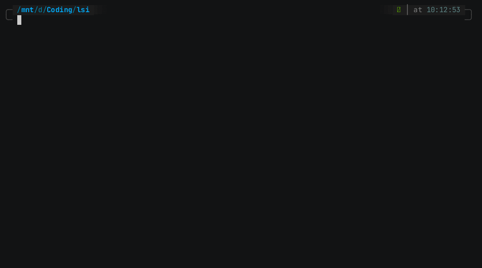

# lsi
A *very* simple improvement on the already great ls-command.

## Demo


## Arguments
```
lsi 0.2.0
A *very* simple improvement on the already great ls-command

USAGE:
    lsi [OPTIONS] [PATH]

ARGS:
    <PATH>    Path to the directory [default: .]

OPTIONS:
    -a, --all            Show all files, including hidden ones
    -d, --dirs-only      Show only directories
    -f, --files-only     Show only files
    -h, --help           Print help information
    -r, --reverse        Reverse the sorting result
    -s, --sort <SORT>    Sort the resulting files and/or direcories in a specific way [default: name] [possible values: size, name]
    -V, --version        Print version information
```